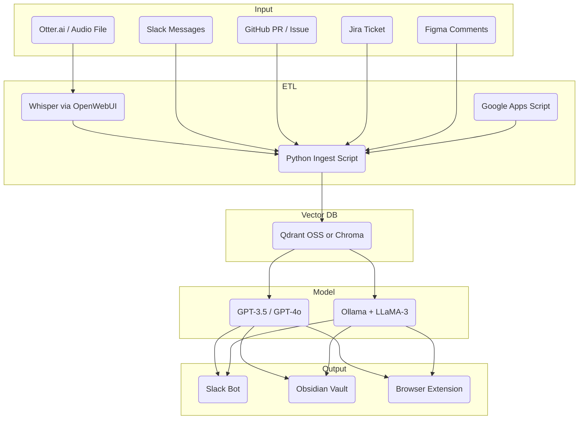

# Vision for AI-Powered Support Tool Suite

## Purpose

While working in tech companies—especially early-stage startups ranging from just a few people to large-scale ventures—I often encountered challenges with unstructured data scattered across Slack, Notion, meeting tools, and more. This made it difficult to maintain a clear overview or quickly access key insights. I began to wonder: could we integrate these fragmented data sources and apply AI to accelerate and clarify decision-making across management and development? That led me to sketch out a suite of tools designed specifically for that purpose.

## Background and Key Points Summary

### Internal Information and AI Utilization Challenges

Internal information is scattered across various tools like Slack, Notion, meeting minutes, and source code, making it difficult to grasp the overall picture. For example, weekly meeting minutes often get buried in Slack and aren't reviewed, or knowledge compiled in Notion goes unsearched and neglected. Existing MCP (Message Control Protocol) servers—systems that provide standardized interfaces to interact with various tools like Slack or Notion—act merely as "access points" for individual tools and haven't achieved cross-functional utilization or a consistent experience. To allow users quick access to necessary information, context needs to be integrated when accessing distributed data, making the use of RAG (Retrieval-Augmented Generation) and memory crucial. Practical trade-off decisions are essential regarding how to provide information to AI (RAG/MCP/Agent) and the operational model (storage location, execution timing, balance between flexibility and cost). For effective system construction, it's necessary to clearly define and organize the roles and collaboration of MCP servers, AI agents, and RAG.

### Summary of Key Points

Here's a summary of the key points from my perspective:

-   **MCP Server Role**: Provide dedicated interfaces for each tool (Slack, Notion, etc.). This premise is also used in the Cline/Glama communities.
-   **AI Agent Structure**: Collect information from multiple MCP servers → Process & Output. According to GPT, this is typical of modern internal AI operations, similar to Glama's "hub agent".
-   **Central DB or Notion for Data Aggregation**: Notion might be advantageous due to ease of storage/search. Notion has a UI, allowing visual confirmation of aggregated information. Exporting to GitHub could also be an option.
-   **Input/Output Channels**: Store in Notion or DB via ETL → Output to Slack, etc. While the output channel varies by use case, the basic structure is input channels -> some document DB -> AI agent (with MCP) -> output channels.
-   **Role Division of Memory and RAG**: Memory = knowledge and context recording, RAG = runtime reference. This division is preferable for design.

Based on this summary, I considered the following three options for unifying company-wide context and information from various tools:

1.  **Utilize Individual MCP Servers**

    *   Use existing MCP servers.
    *   Transcribe things without servers (like meetings) and consolidate them into Notion.
    *   Use Notion as the bot's memory to avoid building a centralized DB.
2.  **MCP Client-Type Encapsulation (Not Recommended)**

    *   Structure where the agent consumes all information.
    *   Implementation and maintenance costs outweigh the benefits.
3.  **ETL into a Dedicated DB (Semi-Recommended)**

    *   Structure data in PostgreSQL or Vector DB for RAG purposes.
    *   However, unifying in Notion might achieve similar effects.

The respective advantages and disadvantages are as follows:

| Option | Advantages                         | Disadvantages                     | Applicable Use Cases                     |
| ------ | ---------------------------------- | --------------------------------- | -------------------------------------- |
| 1      | Minimal cost, easy dev, RAG possible | Cross-search requires effort        | Normal operations, Notion-based memory |
| 2      | High flexibility, centralized mgmt | Huge implementation/maintenance cost | Special tasks, future company-wide opt. |
| 3      | Integrate multiple MCPs, easy norm. | Sync required, Notion might suffice | Analysis/Visualization/Internal RAG    |

If proceeding with Option 1, I think it's best to create folders like the following specifically for LLM/AI agents:

```
bot/
├── tools/
│     ├── Slack/
│     ├── Notion/
│     ├── Meeting/
│     └── ...
├── memory/
│     ├── general/
│     ├── project-xxx/
│     ├── strategy-202505/
│     └── ...
├── external/
│     ├── tech-crunch/
│     └── ...
└── personal/
      ├── 1on1/
      └── thoughts/
```

## Examples from Other Companies

(Just based on what GPT told me...)

| Example              | Overview                                                                                               | Key Points                                                                                                                                                                                                                                                        |
| -------------------- | ------------------------------------------------------------------------------------------------------ | --------------------------------------------------------------------------------------------------------------------------------------------------------------------------------------------------------------------------------------------------------------- |
| Glama.ai             | MCP Server + Hub Agent configuration. MCPs prepared for each service, standardized interface.              | Matches Option 1.                                                                                                                                                                                                                                               |
| Rewind.ai            | Records all user activity + enables search, AI auto-responds.                                             | More agent-oriented than MCP. It uses a custom database backend specifically designed for fine-grained time-indexed retrieval, rather than relying on general-purpose tools like Notion.| Records all user activity + enables search, AI auto-responds.                                             | More agent-oriented than MCP. Custom DB design, not Notion.                                                                                                                                                                                                    |
| Heyday/Holmes        | RAG-type agent construction for Slack, Notion, etc. (especially search-focused).                           | Closer to Notion-based than DB-based, similar to Option 1.                                                                                                                                                                                                     |
| Large Company PoCs | Usually build with RAG first, then gradually introduce MCP servers.                                       | Often evolves in the order RAG→MCP→Agent. Then progresses to more practical integration like lightweight agents linked with Slack/email, habitual dialogue support via Chat UI, and auto-writing/recording to Notion/GitHub, increasing integration into operations. |

## Strategy
Based on the above, I'm considering the following strategy:

-   First, utilize individual MCP servers and use Notion as the information aggregation base.
-   A CUI or Slack notification type AI agent is sufficient (no UI needed).
-   Add DB storage or memory design as needed (optional).
-   Center around Notion, and consider future export to Obsidian or git management.

From here, I'd like to present a collection of reusable ideas and system configuration templates for introducing AI utilization into internal operations. It would be great if these could be implemented at no/low cost.
I've organized ideas applicable to various roles like Development, PM, and Marketing, and included minimal configuration examples.

## Internal AI Use Case Ideas

| ID                              | Idea                             | Description (Brief)                                               | Dev | Marketing | PM |
| ------------------------------- | -------------------------------- | ----------------------------------------------------------------- | --- | --------- | -- |
| `code-review-bot`               | Code-Review TL;DR Bot            | Summarizes PR changes in 3 lines to reduce review burden.        | ✅  |           |    |
| `ci-cd-bot`                     | CI/CD Failure One-liner          | Notifies Slack with the gist of Jenkins build failures.            | ✅  |           |    |
| `incident-postmortem-drafter` | Incident Postmortem Drafter      | GPT automatically drafts postmortems from incident records.       | ✅  |           | ✅ |
| `kpi-diff-dm`                   | KPI Difference DM                | Immediately shares abnormal KPI changes (e.g., day-over-day) via Slack. |     | ✅        | ✅ |
| `rnd-auto-scouter`              | R&D Auto-Scout                   | Collects/summarizes paper info from arXiv etc., promotes new tech discovery. | ✅  | ✅        |    |
| `daily-coach`                   | Daily Coach / Reality-Check      | Generates 10 self-check questions based on daily data.             |     | ✅        | ✅ |
| `customer-support-tier-0-bot` | Customer-Support Tier-0 Bot    | GPT instantly handles common questions, reducing workload.          | ✅  | ✅        |    |
| `marketing-content-generator`   | Marketing Content Generator      | Automatically generates multiple SNS posts from product features.   |     | ✅        |    |
| `competitive-radar`             | Competitive Radar                | Automatically fetches competitor price changes/announcements to Slack. |     | ✅        | ✅ |
| `investor-update-bot`         | Investor Update Bot              | Auto-drafts investor reports from Notion updates.                 |     | ✅        | ✅ |
| `hypothesis-validation-pipeline`| Hypothesis ↔ Validation Pipeline | Automates the loop of LP creation → ad delivery → response collection. | ✅  | ✅        | ✅ |
| `dev-level-up-support`          | Dev Level-Up Support             | Supports Junior dev growth with auto-reviews and sample generation. | ✅  |           | ✅ |
| `otter-supabase-zap`            | Otter→Supabase Zap               | Auto-transcribes/DB-ifies audio interviews for analysis.          | ✅  | ✅        | ✅ |
| `data-privacy-level-design`   | Data Sensitivity Level Design & RLS | Stratifies internal data for Row-Level Security (RLS) utilization. | ✅  |           | ✅ |
| `supabase-initial-setup`        | Supabase Initial Setup Template  | Provides a general API config including pgvector & Edge Functions. | ✅  |           |    |
| `notion-context-browser-extension`| Notion Context Browser Extension | Auto-supplements Notion context when using standard GPT.          | ✅  | ✅        | ✅ |
| `meeting-log-slack-summary-bot` | Meeting Log + Slack Summary Bot  | Summarizes/visualizes current discussion points/decisions from Slack/minutes. | ✅  |           | ✅ |

## System Configuration



## Minimum Configuration Cost

| Purpose          | Tool                                            | Monthly Cost |
| ---------------- | ----------------------------------------------- | ------------ |
| Storage & API    | Supabase (Free Tier)                            | $0           |
| Vector Search/RAG| Supabase pgvector or Qdrant (Docker / Lightsail)| Usage-based  |
| LLM Calls        | GPT-3.5 (regular) + GPT-4o (brainstorming)    | Usage-based  |
| ETL/Functions    | Supabase Edge Functions (Deno)                  | $0           |
| KPI Fetching     | Google Apps Script → Slack                      | $0           |
| Bot Implementation| Bolt.js or Python slack_sdk                     | $0           |
| Logging/Monitoring| Supabase Logs + Slack Notification              | $0           |

## Data Sensitivity Levels

When utilizing internal data with AI, it's necessary to have management policies based on sensitivity rather than treating all data uniformly. Especially with generative AI, trade-offs between security and convenience arise regarding how stored data is handled (full storage vs. partial deletion), and usability for embedding/RAG. Here, we introduce four levels of data sensitivity designed for internal use. For example, while blog drafts or content intended for publication can be fully passed to the LLM without issue, HR/finance information should generally be excluded from RAG, and record access restricted to manual viewing.

| Level               | Example                           | Storage                          | Embedding/RAG | Notes                                      |
| ------------------- | --------------------------------- | -------------------------------- | ------------- | ------------------------------------------ |
| L0 Public           | Blog drafts, OSS Issues           | ✅ Full text                      | ✅            | Information okay for external publication. |
| L1 Internal         | Notion specs, internal threads    | ✅ Full text                      | ✅            | RLS prevents external access.              |
| L2 Sensitive        | Reviews, 1on1s, proposal drafts   | ✅ Text only<br>⛔ Discard audio | ✅            | Column-level encryption + RLS.             |
| L3 Private/Personal | HR, finance, hiring memos, etc. | ✅ Full text                      | ⛔            | Excluded from RAG, manual access only.     |

Furthermore, it's important to design access controls based not only on data sensitivity but also on the user's role and permissions. This principle—combining data classification with user-based access—is fundamental for ensuring both flexibility and security in AI-assisted internal operations.

| Aspect                        | Description                                                                                                                                       |
| ----------------------------- | ------------------------------------------------------------------------------------------------------------------------------------------------- |
| **Permission-Based Control (RLS)** | For example, design RAG access to L2 level internal 1on1 notes only for users with manager-level permissions or higher, blocking search for others. |
| **Restriction by Use Purpose** | Set purpose-specific policies, as the required precision and disclosure scope differ for the same data used for "AI training" vs. "internal RAG responses". |
| **Control via Prompt Context**  | Include constraints in the prompt based on the user's role, e.g., "You are in the role of XXX. You cannot use L2 level data."                     |
| **User-Selective Upload**     | A method where users themselves mark information as "Okay for RAG" (e.g., adding a "RAG OK" tag in Notion).                                  |

## Use Case Specific Configuration Proposals

Below are configuration examples for various use cases, large and small, designed to be as low-cost and easy to implement as possible.

### 1. KPI Notification (Quick Win)

1.  Paste KPI metrics (DAU / MRR, etc.) into Google Sheet nightly.
2.  Use Apps Script to detect ±10 % changes at 7:00 JST.
3.  Auto-post to #metrics via Slack Bot.

### 2. Meeting Summary (Zapier or Edge Function)

1.  Transcribe with Otter → Zapier Trigger.
2.  Zap → Supabase Edge Function (POST).
3.  Summarize "pains, requests, highlights" with GPT-4o.
4.  Save to Supabase + send to Slack DM.

### 3. Daily Coach Generation

1.  `/daily-coach` Slash command → Read KPIs & industry news → Generate "Reality Check 10 questions" with GPT-4o.
2.  Bot generates "Today's 3 TODOs" from the answers and pins them.

### 4. R&D Auto-Scout

1.  GitHub Actions (00:00 UTC).
2.  arXiv API → Collect JSON.
3.  Summarize + score with GPT-4o.
4.  Upsert to Supabase.
5.  Display cards via Figma REST API.

I’d love to hear how others are approaching internal AI integration—feel free to share your ideas, experiences, or helpful resources!
