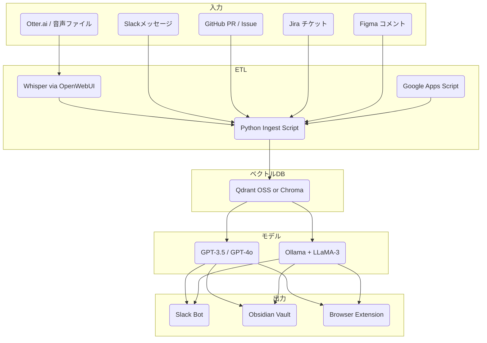

# ai-ideas-org

AI活用を社内業務へノーコスト／ローコストで導入するための、再利用可能なアイディア集とシステム構成テンプレートです。開発・PM・マーケティングなど多様な職種で活用できるアイディアを整理し、最小構成で動作する構成例も併せて記載しています。

---

## Use cases

| ID   | アイディア | ひとこと（説明） | Dev | Marketing | PM |
|------|------------|------------------|-----|-----------|----|
| G-01 | Code-Review TL;DR Bot | PRの変更点を3行に要約し、レビュー負担を軽減する | ✅ | | |
| G-02 | CI/CD 失敗ワンライナー | Jenkins等のビルド失敗原因をSlackに要点通知する | ✅ | | |
| G-03 | Incident ポストモーテム Drafter | 障害発生時の記録をGPTが自動で下書きにまとめる | ✅ | | ✅ |
| G-04 | KPI 差分 DM | 前日比などの異常なKPI変化をSlackで即座に共有する | | ✅ | ✅ |
| G-05 | R&D オートスカウト | arXiv等から論文情報を収集・要約し、新技術の発見を促進する | ✅ | ✅ | |
| G-06 | Daily Coach / Reality-Check | 日々のデータに基づき、自己点検のための10問を生成する | | ✅ | ✅ |
| G-07 | Customer-Support Tier-0 Bot | よくある質問に対しGPTが即座に対応し、工数を削減する | ✅ | ✅ | |
| G-08 | Marketing Content Generator | 製品特徴から自動でSNS向け投稿文を複数生成する | | ✅ | |
| G-09 | Competitive Radar | 競合の価格改定や発表を自動で取得しSlackに通知する | | ✅ | ✅ |
| G-10 | Investor Update Bot | Notionの更新から投資家向け報告書の草案を自動作成する | | ✅ | ✅ |
| G-11 | Hypothesis ↔ Validation Pipeline | LP作成〜広告配信〜反応集計を自動でループ化する | ✅ | ✅ | ✅ |
| G-12 | Dev レベルアップ支援 | Junior向けに自動レビューやサンプル生成で成長を支援する | ✅ | | ✅ |
| G-13 | Otter→Supabase Zap | 音声インタビューを自動で文字起こし・DB化し分析可能にする | ✅ | ✅ | ✅ |
| G-14 | データ機密度レベル設計 & RLS | 社内データを階層化してRLS（行レベル制御）に活用する | ✅ | | ✅ |
| G-15 | Supabase 初期構築雛形 | pgvectorやEdge Functionを含む汎用API構成を提供する | ✅ | | |
| G-16 | Notion Context ブラウザ拡張機能 | 通常のGPT利用時に自動でNotionの文脈を補完して送信する | ✅ | ✅ | ✅ |
| G-17 | 会議ログ＋Slack 整理 Bot | Slackや議事録から現状の論点や決定事項を要約し可視化する | ✅ | | ✅ |

---

## システム構成



---

## 最小構成コスト（月額目安）

| 目的 | ツール | 月額 |
|------|--------|------|
| ストレージ & API | Supabase (Free Tier) | $0 |
| ベクタ検索/RAG | Supabase pgvector or Qdrant (Docker / Lightsail) | ≈ $5 |
| LLM 呼び出し | GPT-3.5（定常）＋ GPT-4o（壁打ち） | 試算 $60 |
| ETL/関数 | Supabase Edge Functions（Deno） | $0 |
| KPI 取得 | Google Apps Script → Slack | $0 |
| Bot 実装 | Bolt.js or Python slack_sdk | $0 |
| ログ/監視 | Supabase Logs + Slack 通知 | $0 |

---

## データ機密度レベル

| Level | 例 | 保存 | 埋め込み/RAG | 備考 |
|-------|----|------|---------------|------|
| L0 Public | ブログ草稿・OSS Issue | ✅ 全文 | ✅ | 社外公開してもよい情報 |
| L1 Internal | Notion仕様書・社内スレッド | ✅ 全文 | ✅ | RLS で社外アクセス不可 |
| L2 Sensitive | インタビュー文字起こし・ユーザー楽曲メタ | ✅ テキストのみ<br>⛔ 音声/WAV破棄 | ✅ | 列単位暗号化 + RLS |
| L3 Private/Personal | 労務・財務・採用メモ等 | ✅ 全文 | ⛔ | RAG対象外、手動アクセスのみ |

---

## ユースケース別構成案

### 1. KPI 通知（Quick Win）
| Step | 実装 |
|------|------|
|① | Google Sheet に KPI 指標 (DAU / MRRなど) を毎晩貼る |
|② | Apps Script で 7:00 JST に ±10 % 変動を検出 |
|③ | Slack Bot で #metrics に自動投稿 |

---

### 2. インタビュー要約（Zapier or Edge Function）
1. Otter で書き起こし → Zapier Trigger
2. Zap → Supabase Edge Function (POST)
3. GPT-3.5 / 4oで「痛み・要望・ハイライト」要約
4. Supabase保存 + Slack DMへ送信

---

### 3. Daily Coach 生成
- `/daily-coach` Slashコマンド → KPI & 業界ニュース読み込み → GPT-4o で「Reality Check 10問」
- 回答から Bot が「今日のTODO 3件」を生成し pin

---

### 4. R&D オートスカウト
- GitHub Actions (00:00 UTC)
  - arXiv API → JSON収集
  - GPT-3.5で要約＋スコアリング
  - Supabaseにupsert
  - Figma REST APIでカード表示

---

## モデル切替とUXポリシー

| 使い分け | デフォルト | 手動切替例 |
|-----------|------------|-------------|
| 日次バッチ処理 | GPT-3.5 | 自動固定 |
| 壁打ち / コーチ | GPT-4o | `/switch-model llama3` |
| 社内RAG検索 | GPT-3.5 + pgvector | `/rag ask <query>` |
| オフライン出先 | Ollama (LLaMA3) | `/rag local <query>` |

---

## ディレクトリ構成

```
ai-ideas/
├── meeting-summary-diffusion/
│   ├── README.md         ← 概要・背景・技術案の候補・進捗
│   ├── design.md         ← 実装方針（柔軟設計）＋構成図（Mermaid）
│   └── src/              ← 実際のコード（PoCやモジュール単位）
├── music-prompt-evolver/
│   ├── README.md
│   └── ...
├── task-categorizer-gpt/
│   ├── README.md
│   └── ...
├── ...
```

---

Pull Request・Issue・アイディア提案歓迎です！
