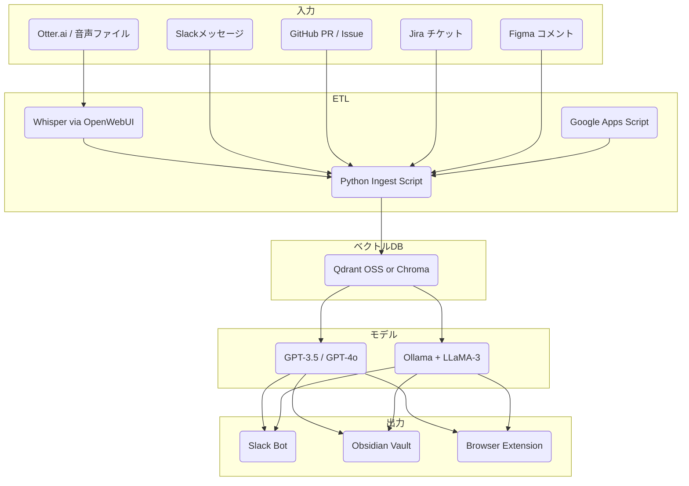

# AI活用支援ツール群の構想

## 目的

普段業務をしていて、テック企業、特に初期フェーズのスタートアップ（数名規模〜メガベンチャー）において、Slack・Notion・オンラインミーティングツールなどに散在する非構造データを統合し、AIをもっともっと使って経営や開発の意思決定を高速化・可視化することができないだろうか、と考えたので、そのためのツール群を考えてみました。

## 背景と要点整理

### 社内情報とAI活用の課題

社内情報がSlack、Notion、ミーティング議事録、ソースコードなど多岐にわたるツールに散在しているため、全体像の把握が困難になっています。たとえば、週次ミーティングの議事録がSlackに埋もれて確認されない、Notionにまとめたナレッジが検索されずに放置されるといった状況がよくあります。既存のMCPサーバなどは個別のツールへの「取得窓口」に留まり、横断的な活用や一貫した体験を提供するには至っていません。ユーザーが必要な情報へ迅速にアクセスするには、分散したデータへのアクセス時に文脈を統合する必要があり、RAG（検索拡張生成）やメモリ（記憶）の活用が鍵となります。AIへの情報提供方法（RAG/MCP/エージェント）、運用モデル（保存場所、実行タイミング、柔軟性とコストのバランス）について現実的なトレードオフを踏まえた設計判断が不可欠です。効果的なシステム構築のためには、MCPサーバ、AIエージェント、RAGの役割分担と連携を明確に定義し、整理することが求められます。

### 要点の整理

以下は、僕の視点でみた要点の整理です。

- MCPサーバの立場: 各ツールに専用の窓口を提供（Slack, Notionなど）。Cline/Glama界隈でもこの前提で設計されている。
- AIエージェントの構造: 複数のMCPサーバから情報収集 → 処理・出力。GPT曰く、モダンな社内AI運用の典型で、Glamaの「hubエージェント」も同様。
- 中央DB or Notionでデータを集約: 保存/検索のしやすさ重視でNotion優位か。NotionはUIがあり、集約した情報を目で確認できる。GitHubにエクスポートしてもいいかも。
- input/output channels: ETL経由でNotionやDBに格納 → Slack等へ出力。ユースケースに応じて出力チャネルは変わるが、input channels -> なしかしらのドキュメントDB -> AI agent (with MCP) -> output channels みたいな構成が基本。
- memoryとRAGの役割分担: memory = ノウハウや文脈記録、RAG = 実行時参照。設計上もこの使い分けが好ましい。


この整理のもとで、各種ツールから会社全体の文脈・情報を統一するには以下3つのオプションがあると考えました。

1. 個別MCPサーバ活用

- MCPサーバが存在するものはそれを使う
- ないもの（ミーティングなど）は書き起こしてNotionに集約
- BotのメモリとしてもNotionを活用すれば、中央集権的なDB構築をせずに済む

2. MCPクライアント型で全て内包

- エージェントに全ての情報を食わせる構造
- メリットよりも実装・保守のコストが高すぎる

3. ETLして専用DBに蓄積

- PostgreSQLやVector DBなどに構造化しRAG用途に使う
- ただしNotionに統一すれば似た効果が出せる場合もある

それぞれのメリット・デメリットは以下の通りです。

| 方針           | メリット               | デメリット                | 適用ユースケース          |
| ------------ | ------------------ | -------------------- | ----------------- |
| 1 | 最小コスト、開発しやすい、RAG可能 | 横断検索には工夫が必要          | 通常業務、Notion収集型メモリ |
| 2 | 自由度が高く一括管理可能       | 実装・保守の工数が膨大          | 特殊業務や将来的な全社最適化    |
| 3 | 複数MCP統合、正規化しやすい    | 同期が必要、Notionで事足りる場合も | 分析/可視化/自社RAG      |


方針1で行う場合、LLM/AIエージェント専用に、以下のようなフォルダを作成するのがいいと思っています。

```
bot/
├── tools/
│     ├── Slack/
│     ├── Notion/
│     ├── Meeting/
│     └── ...
├── memory/
│     ├── general/
│     ├── project-xxx/
│     ├── strategy-202505/
│     └── ...
├── external/
│     ├── tech-crunch/
│     └── ...
└── personal/
      ├── 1on1/
      └── thoughts/
```

## 他社事例

（GPTに聞いただけですが。。）

| 事例                | 概要                                                   | 評価ポイント                             |
| ----------------- | ---------------------------------------------------- | ---------------------------------- |
| Glama.ai      | MCPサーバ+Hub Agent構成。各サービス用にMCPが用意され、共通インターフェース化されている。 | オプション1と一致。                     |
| Rewind.ai     | ユーザー個人のすべての活動を録画＋検索できるようにし、AIが自動応答。                  | MCPというよりエージェント寄り。Notionではなく独自DB設計。 |
| Heyday/Holmes | SlackやNotionなどを対象にRAG型エージェント構築（特に検索特化）               | DB型よりNotion型に近く、オプション1と類似          |
| 大手企業の社内PoC    | 通常、まずRAGで構築し、あとからMCPサーバを段階的に導入                       | RAG→MCP→Agentの順に進化していく流れが多い。その後、Slackやメールと連携する軽量エージェントや、習慣的な対話支援を行うChat UI、さらにNotionやGitHubへの自動書き込み・記録など、より実務に踏み込んだ統合運用へと展開されていくケースも増えてる。|


## 方針
以上を踏まえて、以下のような方針を考えています。

- まずは個別MCPサーバを活用し、Notionを情報集約ベースとする
- AIエージェントはCUI or Slack通知型で十分（UI不要）
- 必要に応じてDB保存やメモリ設計を加える（オプション）
- Notionを中心とし、将来的にObsidianへのエクスポートやgit管理も検討可能

ここからは、AI活用を社内業務へ導入するための、再利用可能なアイディア集とシステム構成テンプレートを上げていきたいと思います。せっかくなので、ノーコスト／ローコストでできるものがいいですね。
開発・PM・マーケティングなど多様な職種で活用できるアイディアを整理し、最小構成で動作する構成例も併せて記載しています。

## AI社内活用アイディア集

| ID   | アイディア | ひとこと（説明） | Dev | Marketing | PM |
|------|------------|------------------|-----|-----------|----|
| code-review-bot | Code-Review TL;DR Bot | PRの変更点を3行に要約し、レビュー負担を軽減する | ✅ | | |
| ci-cd-bot | CI/CD 失敗ワンライナー | Jenkins等のビルド失敗原因をSlackに要点通知する | ✅ | | |
| incident-postmortem-drafter | Incident ポストモーテム Drafter | 障害発生時の記録をGPTが自動で下書きにまとめる | ✅ | | ✅ |
| kpi-diff-dm | KPI 差分 DM | 前日比などの異常なKPI変化をSlackで即座に共有する | | ✅ | ✅ |
| rnd-auto-scouter | R&D オートスカウト | arXiv等から論文情報を収集・要約し、新技術の発見を促進する | ✅ | ✅ | |
| daily-coach | Daily Coach / Reality-Check | 日々のデータに基づき、自己点検のための10問を生成する | | ✅ | ✅ |
| customer-support-tier-0-bot | Customer-Support Tier-0 Bot | よくある質問に対しGPTが即座に対応し、工数を削減する | ✅ | ✅ | |
| marketing-content-generator | Marketing Content Generator | 製品特徴から自動でSNS向け投稿文を複数生成する | | ✅ | |
| competitive-radar | Competitive Radar | 競合の価格改定や発表を自動で取得しSlackに通知する | | ✅ | ✅ |
| investor-update-bot | Investor Update Bot | Notionの更新から投資家向け報告書の草案を自動作成する | | ✅ | ✅ |
| hypothesis-validation-pipeline | Hypothesis ↔ Validation Pipeline | LP作成〜広告配信〜反応集計を自動でループ化する | ✅ | ✅ | ✅ |
| dev-level-up-support | Dev レベルアップ支援 | Junior向けに自動レビューやサンプル生成で成長を支援する | ✅ | | ✅ |
| otter-supabase-zap | Otter→Supabase Zap | 音声インタビューを自動で文字起こし・DB化し分析可能にする | ✅ | ✅ | ✅ |
| data-privacy-level-design | データ機密度レベル設計 & RLS | 社内データを階層化してRLS（行レベル制御）に活用する | ✅ | | ✅ |
| supabase-initial-setup | Supabase 初期構築雛形 | pgvectorやEdge Functionを含む汎用API構成を提供する | ✅ | | |
| notion-context-browser-extension | Notion Context ブラウザ拡張機能 | 通常のGPT利用時に自動でNotionの文脈を補完して送信する | ✅ | ✅ | ✅ |
| meeting-log-slack-summary-bot | 会議ログ＋Slack 整理 Bot | Slackや議事録から現状の論点や決定事項を要約し可視化する | ✅ | | ✅ |

## システム構成




## 最小構成コスト

| 目的 | ツール | 月額 |
|------|--------|------|
| ストレージ & API | Supabase (Free Tier) | $0 |
| ベクタ検索/RAG | Supabase pgvector or Qdrant (Docker / Lightsail) | 従量課金 |
| LLM 呼び出し | GPT-3.5（定常）＋ GPT-4o（壁打ち） | 従量課金 |
| ETL/関数 | Supabase Edge Functions（Deno） | $0 |
| KPI 取得 | Google Apps Script → Slack | $0 |
| Bot 実装 | Bolt.js or Python slack_sdk | $0 |
| ログ/監視 | Supabase Logs + Slack 通知 | $0 |


## データ機密度レベル

AIによる社内データ活用を行う際、すべてのデータを一律に扱うのではなく、機密度に応じた管理方針が必要です。特に生成系AIでは、保存データの扱い方（全文保存 or 一部削除）、埋め込み/RAGへの利用可否など、セキュリティと利便性のトレードオフが発生します。ここでは、社内向けに設計した4段階のデータ機密レベルを紹介します。たとえば、ブログ草稿や公開前提の内容は全文をLLMに渡しても問題ない一方、労務・財務情報は原則RAG対象外とし、記録閲覧も手動に制限すべきです。

| Level | 例 | 保存 | 埋め込み/RAG | 備考 |
|-------|----|------|---------------|------|
| L0 Public | ブログ草稿・OSS Issue | ✅ 全文 | ✅ | 社外公開してもよい情報 |
| L1 Internal | Notion仕様書・社内スレッド | ✅ 全文 | ✅ | RLS で社外アクセス不可 |
| L2 Sensitive | レビュー、1on1、提案ドラフト | ✅ テキストのみ<br>⛔ 音声破棄 | ✅ | 列単位暗号化 + RLS |
| L3 Private/Personal | 労務・財務・採用メモ等 | ✅ 全文 | ⛔ | RAG対象外、手動アクセスのみ |


また、データの機密度だけでなく、使用者の役割や権限によってアクセス可能範囲を制限する設計も重要です。

| 観点                  | 説明                                                                       |
| ------------------- | ------------------------------------------------------------------------ |
| **権限ベース制御（RLS）**    | たとえば、L2レベルの社内1on1メモは、マネージャー以上の権限を持つユーザーのみにRAG参照を許可し、他のユーザーは検索不可にするような設計。 |
| **利用目的による制限**       | 同じデータでも「AI学習用」と「社内RAG回答用」では必要な精度や公開範囲が異なるため、目的別ポリシーを設定。                  |
| **プロンプトコンテキストでの制御** | 使用者の立場に応じて、プロンプトに「あなたはXXXの立場です。L2レベルのデータは利用できません」など制約を入れる。               |
| **ユーザー選択制のアップロード**  | ユーザー自身が「この情報はRAG対象に含めてよい」とマークをつける方式（例：Notionに「RAG可」タグをつける）。              |


## ユースケース別構成案

以下は、大小さまざまなユースケースに対し、できるだけ低コストかつ実装容易な構成例を紹介しています。

### 1. KPI 通知（Quick Win）

1. Google Sheet に KPI 指標 (DAU / MRRなど) を毎晩貼る
2. Apps Script で 7:00 JST に ±10 % 変動を検出
3. Slack Bot で #metrics に自動投稿


### 2. ミーティング要約（Zapier or Edge Function）

1. Otter で書き起こし → Zapier Trigger
2. Zap → Supabase Edge Function (POST)
3. GPT-4oで「痛み・要望・ハイライト」要約
4. Supabase保存 + Slack DMへ送信


### 3. Daily Coach 生成

1. `/daily-coach` Slashコマンド → KPI & 業界ニュース読み込み → GPT-4o で「Reality Check 10問」
2. 回答から Bot が「今日のTODO 3件」を生成し pin


### 4. R&D オートスカウト

1. GitHub Actions (00:00 UTC)
2. arXiv API → JSON収集
3. GPT-4oで要約＋スコアリング
4. Supabaseにupsert
5. Figma REST APIでカード表示


皆さんの現場ではどう運用していますか？アイディア提案やおすすめのウェブサイトありましたら教えてください！
