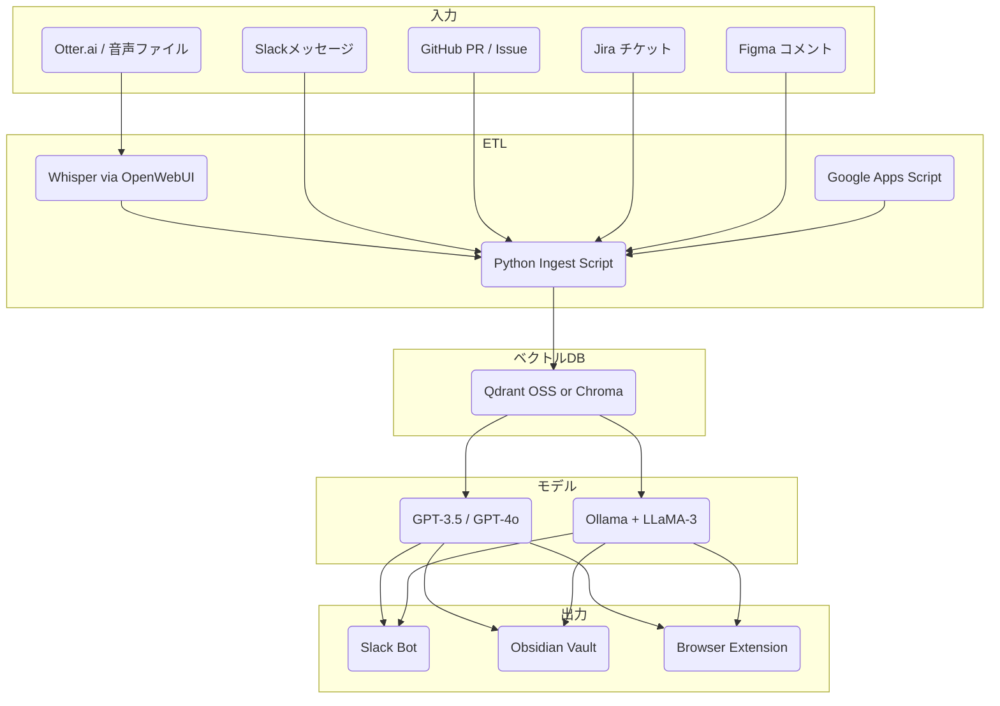

# ai-ideas-org

AI活用を社内業務へノーコスト／ローコストで導入するための、再利用可能なアイディア集とシステム構成テンプレートです。開発・PM・マーケティングなど多様な職種で活用できるアイディアを整理し、最小構成で動作する構成例も併せて記載しています。

---

## Use cases

| ID   | アイディア | ひとこと（説明） | Dev | Marketing | PM |
|------|------------|------------------|-----|-----------|----|
| G-01 | Code-Review TL;DR Bot | PRの変更点を3行に要約し、レビュー負担を軽減する | ✅ | | |
| G-02 | CI/CD 失敗ワンライナー | Jenkins等のビルド失敗原因をSlackに要点通知する | ✅ | | |
| G-03 | Incident ポストモーテム Drafter | 障害発生時の記録をGPTが自動で下書きにまとめる | ✅ | | ✅ |
| G-04 | KPI 差分 DM | 前日比などの異常なKPI変化をSlackで即座に共有する | | ✅ | ✅ |
| G-05 | R&D オートスカウト | arXiv等から論文情報を収集・要約し、新技術の発見を促進する | ✅ | ✅ | |
| G-06 | Daily Coach / Reality-Check | 日々のデータに基づき、自己点検のための10問を生成する | | ✅ | ✅ |
| G-07 | Customer-Support Tier-0 Bot | よくある質問に対しGPTが即座に対応し、工数を削減する | ✅ | ✅ | |
| G-08 | Marketing Content Generator | 製品特徴から自動でSNS向け投稿文を複数生成する | | ✅ | |
| G-09 | Competitive Radar | 競合の価格改定や発表を自動で取得しSlackに通知する | | ✅ | ✅ |
| G-10 | Investor Update Bot | Notionの更新から投資家向け報告書の草案を自動作成する | | ✅ | ✅ |
| G-11 | Hypothesis ↔ Validation Pipeline | LP作成〜広告配信〜反応集計を自動でループ化する | ✅ | ✅ | ✅ |
| G-12 | Dev レベルアップ支援 | Junior向けに自動レビューやサンプル生成で成長を支援する | ✅ | | ✅ |
| G-13 | Otter→Supabase Zap | 音声インタビューを自動で文字起こし・DB化し分析可能にする | ✅ | ✅ | ✅ |
| G-14 | データ機密度レベル設計 & RLS | 社内データを階層化してRLS（行レベル制御）に活用する | ✅ | | ✅ |
| G-15 | Supabase 初期構築雛形 | pgvectorやEdge Functionを含む汎用API構成を提供する | ✅ | | |
| G-16 | Notion Context ブラウザ拡張機能 | 通常のGPT利用時に自動でNotionの文脈を補完して送信する | ✅ | ✅ | ✅ |
| G-17 | 会議ログ＋Slack 整理 Bot | Slackや議事録から現状の論点や決定事項を要約し可視化する | ✅ | | ✅ |

---

## システム構成

---

## 最小構成コスト（月額目安）

| 項目 | ツール | 月額 |
|------|--------|------|
| Whisper 書き起こし | OpenWebUI / Colab | $0〜10 |
| LLM | GPT-3.5 / 4o or Ollama + LLaMA | $20〜60 |
| ベクトルDB | Qdrant / Chroma (ローカルDocker or Lightsail) | $0〜5 |
| KPI処理 | Apps Script | $0 |
| Slack通知Bot | Python + slack_sdk / Bolt.js | $0 |
| Obsidian / Git | 手元運用で $0 |  |

> **合計**：$20〜70/月程度。

---

## 特徴
- OSS中心で誰でも再現可能
- ObsidianやSlackと親和性が高い
- モジュール分離しやすく、拡張・移植も簡単
- 社内文脈に対応したLLM活用を徹底的に実現

---

Pull Request・Issue・アイディア提案歓迎です！
