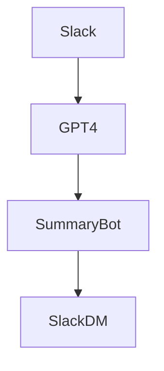

# 🧠 設計ドキュメント：[プロジェクト名]

## 1. 要求・ゴール定義
- [短期的に解決したいこと]
- [理想的なアウトプットの姿]

## 2. 設計案（複数ある場合は列挙）

### 案A：最小構成（PoC）
- LLM: OpenAI GPT-4
- 入力：Slackから取得
- 処理：要約 → トピック分類
- 出力：Slack DMに返信

### 案B：+ Notion同期
- Notion DB に要約ログを保存
- タグづけされたトピックをリッチ表示

## 3. 採用案・理由
→ 現時点ではPoC速度重視のため案Aを選定。将来的に案Bへ拡張予定。

## 4. システム構成図（Mermaid推奨）

### 5. 使用技術
- LLM: GPT-4 via OpenAI API
- デプロイ先: Cloud Run
- インフラ: Firebase / Supabase
- LangChain or LlamaIndex（必要に応じて）

### 6. 今後の展望・改良方針
- Notion連携
- フィードバックループによる要約品質向上
